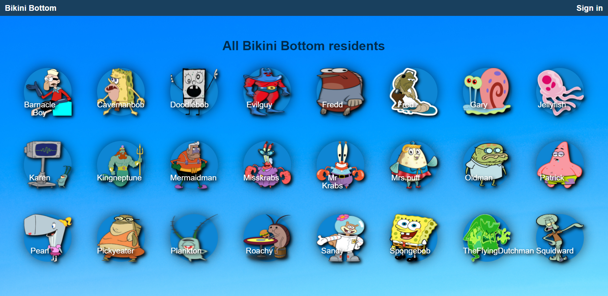
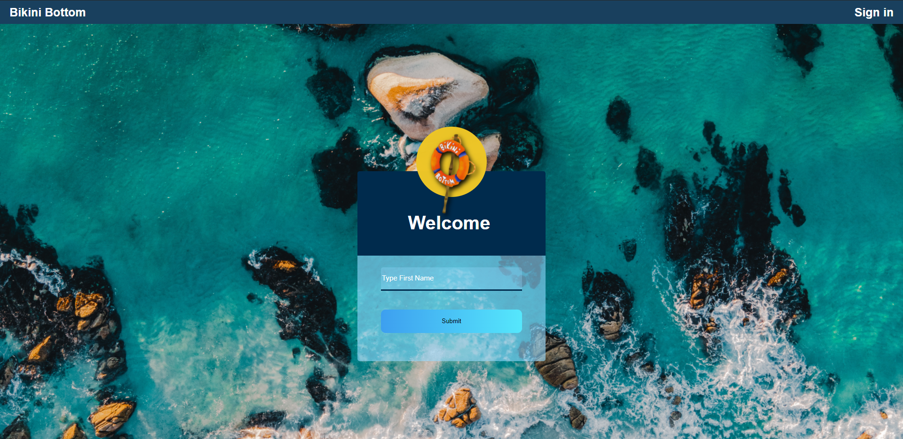
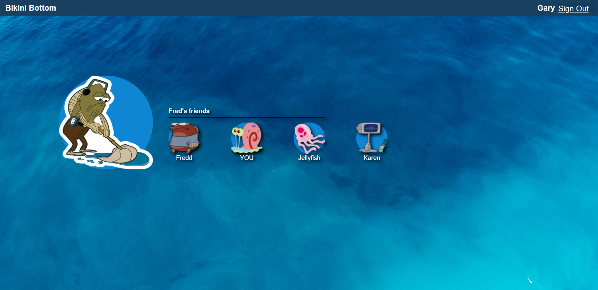

# Mini-Project: BikiniBottom Social Network!

https://user-images.githubusercontent.com/25377766/116756253-cef39780-a9d9-11eb-9c2b-651c53b9d5c8.mp4

## Goal

A website for bikini bottom residents!

### The Frontend

1. Open a terminal in VS Code
2. Type `cd frontend`
3. Type `yarn install`

Use `yarn dev:frontend` to start the frontend dev environment.

### The Backend

1. Open _another_ terminal in VS Code
2. Type `cd backend`
3. Type `yarn install`

Use `yarn dev:backend` to start the backend dev environment.

---

## The Project

This is a website for bikini bottom residences. Sign In to see who’s connected to who and build new connections.  

### Homepage

### The Login Page

### User Profile

